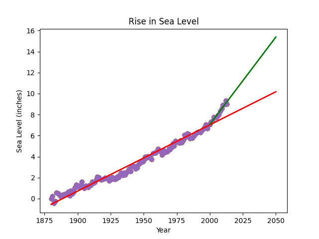

# Sea Level Predictor

This is the boilerplate for the Sea Level Predictor project. Instructions for building your project can be found at [freeCodeCamp - Data analysis with python : Sea level predictor](https://www.freecodecamp.org/learn/data-analysis-with-python/data-analysis-with-python-projects/sea-level-predictor)  

---

## Detail  

1. Analyze a dataset of the global average sea level change since 1880.  
2. Use the data to predict the sea level change through year 2050.  

### Task

- [X] Import data epa-sea-level.csv
- [X] Use _matplotlib_ to create a **scatter plot** using the **Year** column as the _x-axis_ and **the CSIRO Adjusted Sea Level column** as the _y-axix_.
- [X] Use the **linregress** function from _scipy.stats_  
  - [X] Get the slope and y-intercept of the line of best fit.
  - [X] Plot the line of best fit **over the top** of the scatter plot.
  - [X] Make the line go through the year 2050 to predict the sea level rise in 2050  
- [X] Plot a new line of best fit just using the data from year 2000 through the most recent year in the dataset.  
  - [X] Make the line also go through the year 2050  
  - [X] To predict the sea level rise in 2050 if the rate of rise continues as it has since the year 2000.
- [X] The _x_ _label_ should be **Year**, the _y_ _label_ should be **Sea Level** (inches), and the _title_ should be **Rise in Sea Level.**

### Result

  
  
